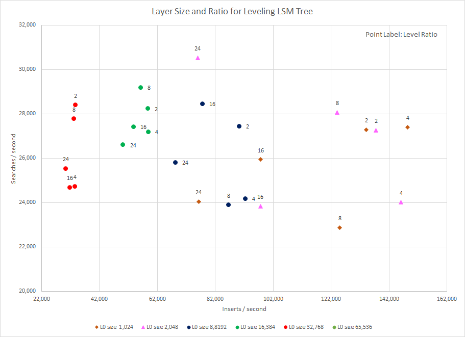
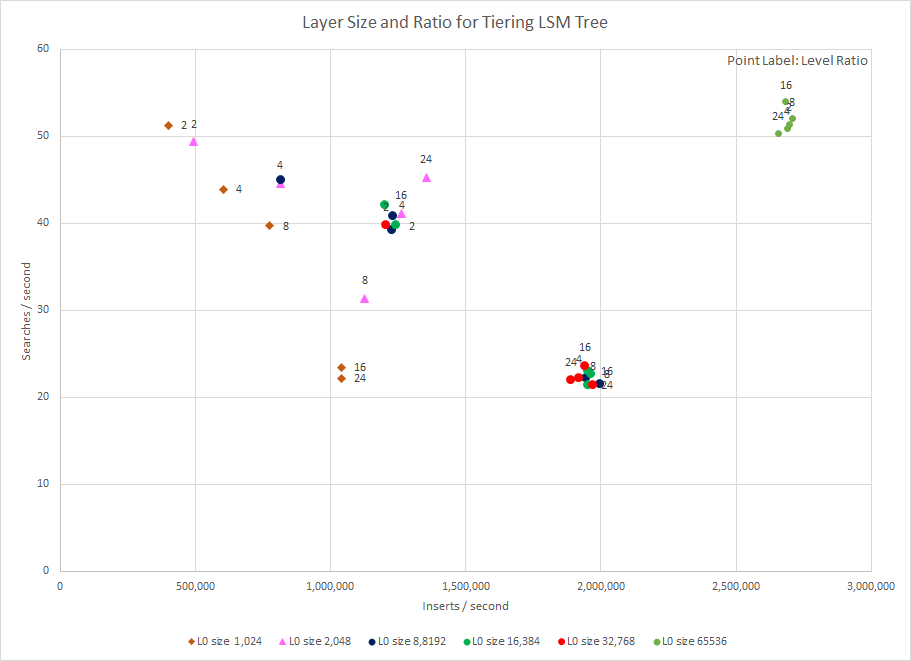
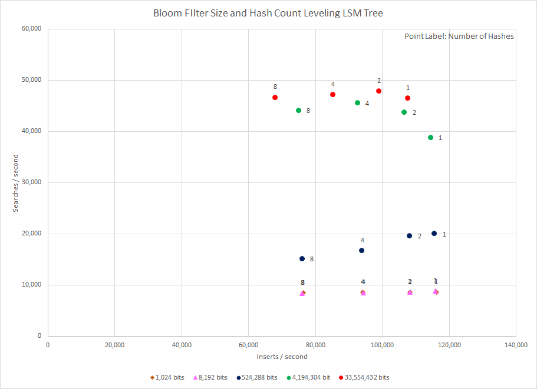
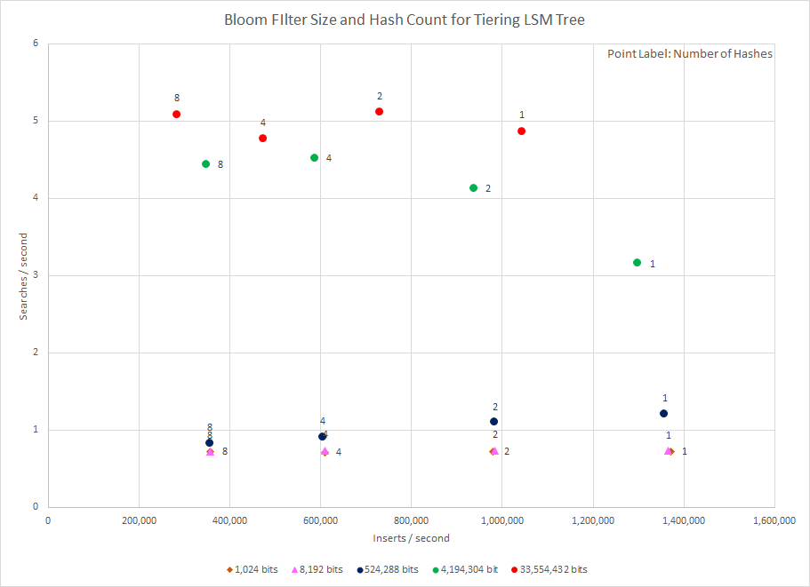
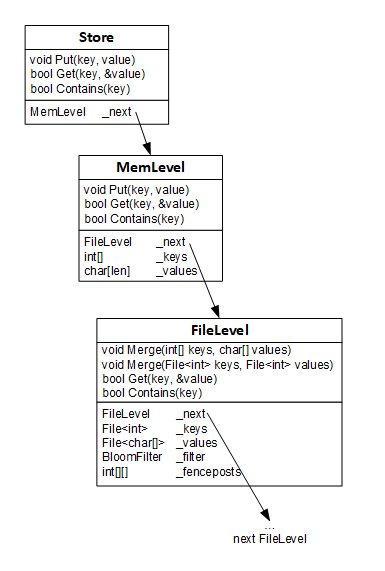

# Lemur – a simple LSM-tree key-value store

Pat Leahy   pat@patleahy.com

## Introduction

I implemented a library in C++ which provides a key-value store. The keys are limited to integers and the values are fixed length strings. The store is implemented as an LSM tree supported by both tiering and leveling.[^1][^2] The memory and file levels of the LSM Tree used columnar layouts, i.e. the keys and vales are stored in their own memory arrays and files. This probably results in better cache locality when performing linear searches for keys; I didn’t verify this with tests. It uses Bloom filters, fence posts to optimize searching the on-disk levels, and I wrote two command line programs to exercise the library. The first program (lemur-test) inserts random values and then searches for random values, verifying that the key-value store is behaving as expected. The second program (lemur) performs many inserts and then searches and reports how long the inserts and searches took. The size of the LSM memory level, the ratio between levels, the size of the Bloom filters, and the number of hashes can all be specified at the command line. I used this program to measure the effect of these parameters and analyzed the results.

## Design

The key-value store was implemented in C++, compiled with the g++ (7.5.0) compiler on Ubuntu 18.04. The figure 5 shows the most important classes in the implementation of the library. The entry point into the library is the Store class which has three methods for inserting and searching the LSM tree. Store::Put will insert a value in the store with a key. Store::Get will retrieve a value from the store using a key, and Store::Contains will report if a key is present in the store. Store has a reference to a MemLevel object. This is the first level of the LSM tree.

The MemLevel stores keys and values in two arrays. If the LSM tree is performing tiering, then new keys and values are appended to the arrays. If leveling is being performed, keys are inserted into the key array such that it is kept sorted. The corresponding values are inserted in the same index in the value array.

When the MemLevel arrays are full, MemLevel creates a FileLevel object and keeps a pointer to it in _next. It calls the FileLevel’s Merge method, passing the key and value arrays. Each FileLevel keeps its own pair of files for storing keys and values at each layer. When tiering, the keys and values are appended to the FileLevel’s files. When leveling is performed, a merge sort must be performed to ensure that the resulting key file is sorted, and the value file contains the values in the order which corresponds to their keys. The merge sort is done by copying from both the MemLevel and existing FileLevel into a pair of temporary files and then renaming the temporary files over the FileLevel’s files. The merge must be stable, two values with the same key must be kept in the same order they were inserted so that the most recent value is returned if the key is searched for.

When the FileLevel is full it will create a new FileLevel object and a pointer to it in _next. The ratio parameter and size of the current MemLevel is used to determine the size of the FileLevel. The older or parent FileLevel will call the new or child FileLevel’s Merge method, passing in the key and value file references. The FileLevel will perform the same merge operation as it does when merge from the MemLevel except that both sides of the merge are pairs of files. As the merge is happening a Bloom Filter and fence posts are updated to help with searching for keys.

I implemented several classes which wrap the memory arrays and files so that the merge algorithms and search algorithms can operate keys and values in both arrays and files. InputFileReader and InputMemReader both implement the InputReader interface to provide sequential read access to keys and values in memory arrays or files. InputFileReader  implements buffering. OutputFileWriter supports buffered writing to key and value files.

When Store.Get or Store.Contains is called it will call the corresponding method on MemLevel. The MemLevel does not maintain a Bloom Filter or fence posts, the array is always searched. When doing tiering, a linear search of the keys array is done. The index of the key found is used to return the corresponding value from the value array. When doing leveling a binary search is performed.

If the key is not found in the MemLevel keys array and the MemLevel has a child FileLevel, then the Get or Contains method is called on the FileLevel. The file level will first check the Bloom Filter, and if that passes it will search the FileLevel using either a linear or binary search depending on whether we are doing tiering or leveling. The search algorithms operate on KeyValues object which provide random access abstraction to key-value pairs in either arrays or files.

The Bloom Filter is implemented using a double-hash algorithm described in a blog post by Michael Schmatz[^3] and a paper by Adam Kirsch and Michael Mitzenmacher[^4]. The Bloom Filter implementation uses Austin Appleby’s[^5] open source implementation of the MurmurHash function.

# Test Procedures

I used the lemur command line tool to test the performance of the key value store and the LSM tree it uses. Using this tool, you specify that n inserts should be done followed by m searches. The tool will insert every even number key from 0 to n\*2-1 into the store, in a random order. The tool will then perform m searches for keys randomly selected between 0 and n\*2-1. This means that half the searches will be for existing keys and half will not.

I ran two sets of tests using the tool. In the first, I used different values of memory level sizes from 1,024 items to 65,536 items and different layer ratios from 2 to 24. An item is 32-bit integer key and a 20-character array value. In this test I used a fixed Bloom Filter of 1,048,576 bits and 4 hashes. In the second set of tests, I kept the memory layer size fixed at 8,192 items with a ratio of 4 and varied the Bloom Filter size between 1,024 and 33,554,432 bits and between 1 and 8 hashes.

In all tests using leveling I performed 1,000,000 inserts and 1,000 searches. In all tests using tiering I performed 100,000 inserts and 100 searches. The tests were run on a Microsoft Azure virtual machine (Standard DS1 v2) with 1 vCPU, 3.5 Gb RAM, and a Premium SSD. Each set of parameters was run 20 times, then the average insert and search times were calculated.

## Analysis

The level size and ratio data for the leveling LSM tree does not show a clear pattern for smaller levels (figure 1). Starting at 8,192 items in the memory level, it is clear that as the size of the levels increases inserts/second decreases. The size of the levels did not affect the searches/second; this may be due to the Bloom Filter and fence post optimizations. There may be some correlation between search speed and level ratio.

There is less correlation in the results of the tests or size and ratio when using tiering (figure 2). It appears that insert speed increases with level size; however no other trends are obvious. This may be because I was using the C++ standard libraries fstream library which uses the operating systems file operations. There may be effects of i/o buffering and other optimizations which I’m not aware of.

The effect of changing the Bloom Filter size and hash count was obvious in the data (figures 3 & 4). Searches/second increases as the size of the filter increases, and Inserts/second decreases as the number of hashes increases. This is true when both leveling and tiering. You can also see in these tests that the insert rate is 10 times faster for tiering, and the search rate is 10,000 times slower for tiering. The order of this effect is be expected; however the magnitude of the difference may be because a less than optimal layer size and ratio was used.

## Figures

## References

[^1]: P. E. O’Neil, E. Cheng, D. Gawlick, and E. J. O’Neil. The log-structured merge-tree (LSM-tree). Acta Informatica, 33(4):351–385, 1996.

[^2]: N. Dayan, M. Athanassoulis, and S. Idreos. Monkey: Optimal Navigable Key-Value Store. In Proceedings of the 2017 ACM International Conference on Management of Data. Pages 79–94, 2017.

[^3]: M. Schmatz. How to write a Bloom filter in C++, Finding Protopia. https://findingprotopia.org/posts/how-to-write-a-bloom-filter-cpp/ 2016.

[^4]: Kirsch, A. and Mitzenmacher, M. (2008), Less hashing, same performance: Building a better Bloom filter. Random Struct. Alg., 33: 187-218. https://doi.org/10.1002/rsa.20208

[^5]: A. Appleby. MurmurHash3, https://github.com/aappleby/smhasher. 2016.
